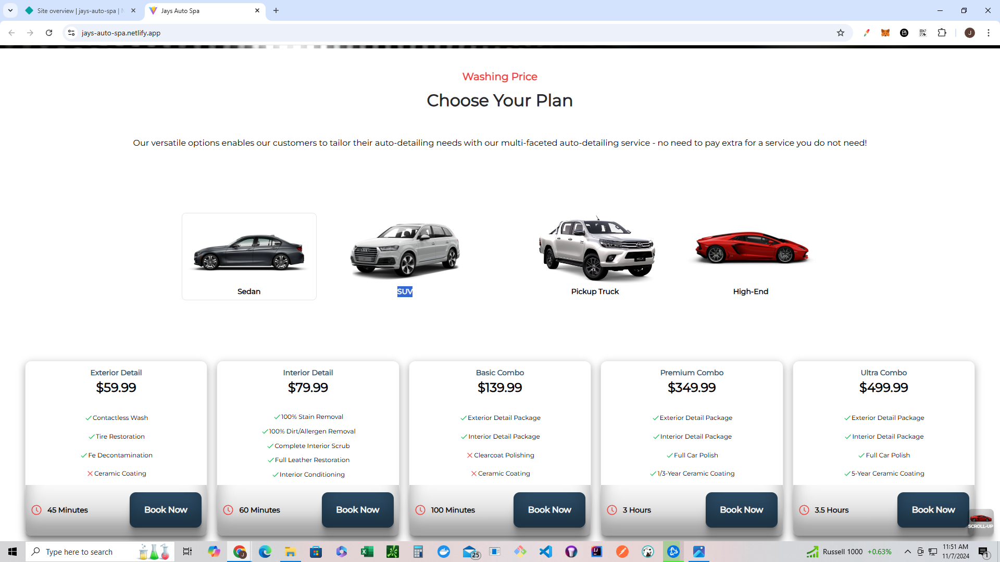
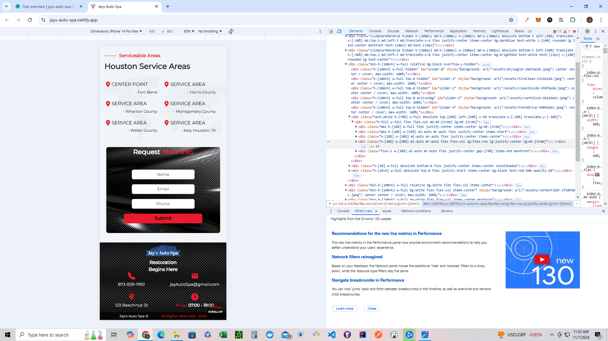

# Auto-Detail-Booking Site Client-Side Code
React.js alongside tailwindcss is the frontend backbone for this project. Redux js and redux toolkit are utilized to memoizing client data for better performance. Framer motion utilized to create animations and interactive features. 

## Landing Page
Automatic and manual slideshow utilized to showcase detailing business' skills, expertise, and commitment.

## More Details Page
Simply designed page detailing more information about the practices and booking methods of the detailing company.

## Booking Options Page
Contains all detailing options available as a sliding card that contains both a picture of the detailing process as well as information about what the detailing option provides in service.

## Vehicle Pricing Page
Provides four types of vehicles able to be serviced as well as their pricing options per service.

## Previous Work Page
Interactive before and after slider of services provided to showcase detailing company's expertise.

## Testimonials Page

## Contact and Location Page

## Responsiveness
Responsive across all devices and media screens including IPad, IPhones, Samsung Galaxy, Pixel, and more.

